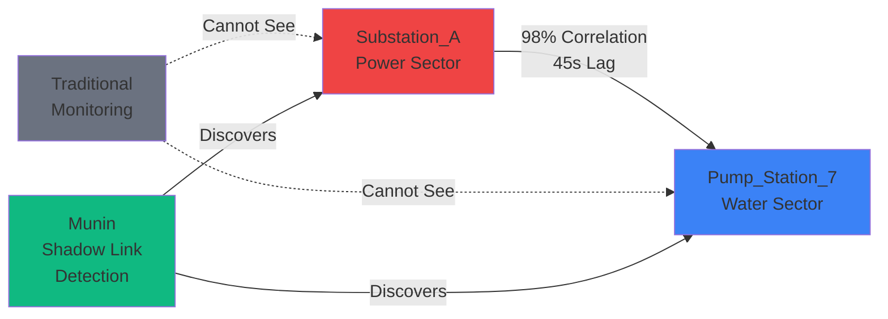
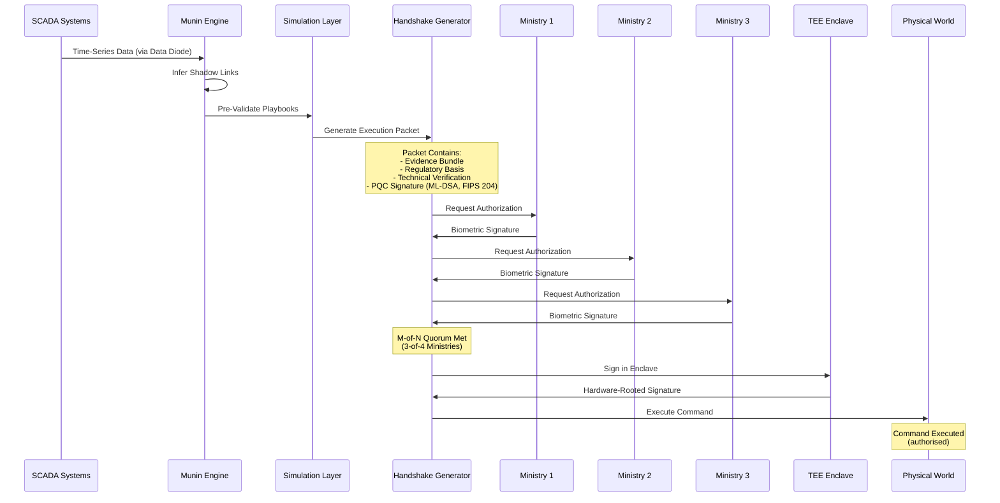
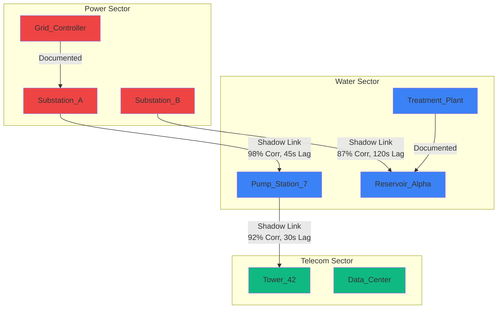

# Munin: Sovereign Infrastructure Orchestration Platform

Munin is **decision support** for critical infrastructure operators. It reduces crisis response time by turning ad-hoc cross-agency coordination into pre-simulated, pre-packaged response options that humans can approve quickly. Munin discovers cross-sector dependencies from operational telemetry, stress-tests incident playbooks in shadow mode, and generates an **authorisation packet** containing evidence, uncertainty, safety constraints, and an audit trail. Operators and agencies still decide and sign; Munin's job is to make the decision defensible and fast.

*Humans still decide.* Munin does not execute actions autonomously; it recommends, humans authorise.

---

## Wedge: flood and water (v1)

<<<<<<< HEAD
The current focus is **flood and water infrastructure** (reservoirs, pumps, floodgates) in one geography. Munin provides: cascade prediction from inferred dependencies, pre-approved playbook packets, and an audit trail. Initially **read-only and advisory**—no SCADA write access in v1.
=======
**Munin is the first Sovereign Orchestration Layer designed for zero-latency crisis response. It solves the Liability Paralysis of the state by bridging the gap between operational systems (SCADA) and authority (Law).**
>>>>>>> 0b54ca9daae3a00042c9b384efed940736403e03

---

## The thesis

**The main bottleneck in crisis response is not data but the time required for legal authorisation and cross-agency sign-off.** Munin addresses this by pre-validating playbooks and generating execution packets that carry the necessary regulatory basis.

**The Cascade Timeline:**
- **0 seconds**: Power substation fails
- **30 seconds**: Water pumps downstream lose power
- **2 minutes**: Water pressure drops in residential districts
- **5 minutes**: Backup generators fail due to fuel supply issues
- **15 minutes**: Critical services (hospitals, emergency services) affected
- **2-6 hours**: Human operators coordinate across agencies, verify legal authorization, execute response
- **Result**: Cascade has already consumed entire sectors before response can be authorised

**Munin maintains exhaustive pre-simulation of the scenario space—single-origin failures, multi-fault and correlated (shadow-link) stress scenarios—with a continuously updated library of pre-approved playbooks and cryptographic execution packets that carry the required regulatory basis.**

### Trust: why the packet is defensible

The authorisation packet is built for **trust**: an evidence bundle (which dependencies, correlation windows, confounders), explicit uncertainty (e.g. confidence intervals, counterexample windows), safety constraints (Logic-Lock, playbook invariants), and a full audit trail. Operators and agencies see what the recommendation is based on and can reject or approve; Munin never executes.

---

<<<<<<< HEAD
## Shadow Links: Cross-Sector Dependency Discovery
=======
## Shadow Links: Cross-sector dependencies

**The discovery:**
>>>>>>> 0b54ca9daae3a00042c9b384efed940736403e03

Infrastructure dependencies are not documented. A water pump failure cascades to power grid instability, but this relationship is not in any database—it exists only in the physics of the system.

**Traditional Systems:**
- Monitor only within-sector (water systems don't "see" power systems)
- Require manual dependency mapping (impractical at national scale)
- Cannot predict cross-sector cascades
- React after failures occur, not before

**Munin's Solution:**
- Automatically infers cross-sector dependencies from time-series correlation
- Discovers relationships that exist in physics but not in documentation
- Predicts cascades before they occur
- Enables proactive response at machine speed

### The Math Behind the Discovery

Munin uses temporal correlation analysis with lag detection to discover "Shadow Links"—dependencies that exist in the physics but are invisible to traditional monitoring systems.



**Example Output:**
```
[ANALYSIS] Ingesting Substation_A and Pump_Station_7 logs...
[MATCH] 98% Temporal Correlation found.
[WARNING] Physical Shadow Link detected. Sector 4 vulnerability confirmed.
```

This enables Munin to prevent cross-sector cascading failures by discovering dependencies that traditional systems cannot see.

### How we avoid false links (evidence and trust)

Correlation with lag is a **candidate generator**, not proof of causation. Confounders (weather, shared controllers, maintenance, load shedding) can produce spurious links. Munin treats trust as the product:

- **Robustness checks**: Stability across time windows, partial correlation, sensor health filtering (missingness, stuck-at, drift). Low-stability or unhealthy-sensor edges are dropped.
- **Evidence hierarchy**: Each edge has evidence windows with correlation, lag, and quality context. We surface **counterexample windows** (negative or weak correlation) as well as supporting windows, so operators see uncertainty.
- **Physics and constraints**: Logic-Lock and playbook constraints enforce invariants (e.g. max RPM, valve/pump state). Recommendations that violate constraints are rejected.
- **Evidence-quality dashboard**: The `munin evidence-quality` CLI and pipeline output HIGH/MEDIUM/LOW confidence and confounder notes so operators can judge reliability.

We do not claim causal identification from correlation alone; we claim *candidate dependencies plus evidence and controls* that make the authorisation packet defensible.

**Try it yourself:**
```bash
python3 engine/detect_shadow_link.py
```

---

## One-Command Demo (Show Don't Tell)

Run the full Carlisle flood demo start-to-finish so reviewers can see Munin in 5 minutes:

```bash
./demo.sh
# or
./scripts/munin demo carlisle-2011
```

Output includes: Shadow Links found, scenarios simulated, playbooks generated, **Traditional 2–6 hours vs Munin &lt; 4 minutes**, lives/damage impact, and authorization flow. Optional: `./scripts/munin viz cascade` then open `engine/out/demo_carlisle/cascade_animation.html` for side-by-side cascade animation. If you see a connection-refused message for `localhost:3000`, that’s the optional decision API; the demo still completes—start the app with `npm run dev` if you want the full flow.

**CLI reference:**
- `munin demo carlisle` – full pipeline demo
- `munin scenarios analyze [--output scenarios_analysis.md]` – scenario library with quantified outcomes
- `munin evidence-quality` – evidence quality dashboard (HIGH/MEDIUM/LOW confidence, confounder analysis)
- `munin applicability` – when Munin does / doesn’t apply (Katrina ✓, Texas 2021 ✗, Dubai 2024 ✗)
- `munin viz cascade` – generate cascade animation HTML
- `munin perf` – performance benchmarks
- `munin regulatory [UK|US|EU]` – regulatory compliance mapper

---

## Extended capabilities and future roadmap

*The main story for v1 is the wedge (flood/water, read-only) and trust (evidence, uncertainty, constraints, audit). The sections below describe the full technical stack and future roadmap (e.g. sovereign mesh, satellite verification, digital vault, safety PLCs)—not all are deployed in the initial wedge.*

### Post-Quantum Cryptography (PQC)

**Algorithm**: ML-DSA (FIPS 204), Dilithium3 parameter set

**Why**: Quantum computers will break current cryptographic signatures (RSA, ECDSA) by 2030. Munin must be future-proof.

**Decision**: All critical commands are signed with ML-DSA (FIPS 204), ensuring that even if quantum decryption becomes available, Munin's authorization packets remain cryptographically secure.

See [research/pqc-whitepaper.md](./research/pqc-whitepaper.md) for detailed technical analysis.

### Hardware Data Diodes

**What**: Physical one-way data flow devices (data cannot flow out)

**Why**: Air-gapping is the only way to guarantee that Munin cannot be remotely compromised. No outbound network traffic is possible.

**Decision**: All data ingestion happens through hardware data diodes. Munin operates in a physically isolated network.

### Trusted Execution Environments (TEE)

**Platforms**: Intel SGX, ARM TrustZone, AMD SEV

**Why**: Even if an attacker gains root access, they cannot bypass hardware-rooted validation. Logic-Lock (physics validation) runs inside TEE enclaves.

**Decision**: All handshake signing happens in TEE enclaves, providing digital sovereignty over foreign hardware.

### Byzantine Fault Tolerance (M-of-N Multi-Signature)

**Why**: A single compromised administrator or rogue official could sabotage critical infrastructure. Traditional access control (username/password) is insufficient for national-scale operations.

**Decision**: Critical actions require M-of-N cryptographic signatures from physically separated ministries. Even if 1 ministry is compromised, action cannot be authorised.

**Example**: 3-of-4 ministries must sign to authorise opening a dam during a flood. No single person or ministry can authorise alone.

### Protocol Translation Layer

**Protocols**: Modbus, DNP3, Profibus, BACnet, OPC UA, IEC 61850

**Why**: Legacy infrastructure uses protocols from the 1980s-2000s. These protocols are vendor-locked, temporally distributed, and non-interoperable.

**Decision**: All protocols are translated into a unified time-series format, enabling "zero-rip-and-replace" integration with existing infrastructure.

---

## The Authoritative Handshake Flow

**How Munin transforms inference into permission:**



**Latency Comparison:**

**Traditional Process (Without Munin):**
```
Incident Detection: 5-15 minutes
Cross-Agency Coordination: 30-60 minutes
Legal Review: 30-90 minutes
Multi-Ministry Approval: 60-120 minutes
Command Execution: 5-10 minutes
─────────────────────────────────────
Total: 2-6 hours
```

**With Munin:**
```
Incident Detection: 5-15 minutes (same)
Playbook Retrieval: <100ms (pre-validated)
Handshake Generation: <100ms (automated)
Biometric Authorization: <15 minutes (3 ministries × 5 min)
Command Execution: 5-10 minutes (same)
─────────────────────────────────────
Total: 20-30 minutes
```

**Latency Reduction: 85-90% faster response time**

---

## The Dependency Graph

**How Munin discovers cross-sector dependencies:**



**Shadow Links (amber) are cross-sector dependencies that exist in physics but are not documented. Traditional monitoring systems cannot see these relationships.**

---

## Complete Technical Documentation

This document provides an exhaustive technical overview of every component, feature, and capability of the platform.

---

## Table of Contents

1. [Overview](#overview)
2. [Problem Statement](#problem-statement)
3. [Architecture](#architecture)
4. [Core Features](#core-features)
5. [Data Pipeline](#data-pipeline)
6. [Security Architecture](#security-architecture)
7. [API Reference](#api-reference)
8. [User Interface](#user-interface)
9. [Installation & Setup](#installation--setup)
10. [Development Guide](#development-guide)
11. [Technical Specifications](#technical-specifications)

---

## Overview

### What is Munin?

Munin is a sovereign infrastructure orchestration platform designed for national-scale critical infrastructure management. It provides:

- **Automated Dependency Discovery**: Infers cross-sector infrastructure dependencies from time-series data without manual configuration
- **Pre-Validated Crisis Response**: Generates authorised execution packets (handshakes) with cryptographic signatures and regulatory basis
- **Byzantine Fault Tolerance**: M-of-N multi-signature authorization prevents single-point-of-failure sabotage
- **Real-Time Cascade Prediction**: Simulates cascading failures before they occur, enabling proactive response
- **Hardware-Rooted Security**: Trusted Execution Environments (TEEs) and post-quantum cryptography ensure command integrity

### Key Capabilities

1. **Protocol Translation**: Universal OT-to-Graph connectors for Modbus, DNP3, Profibus, BACnet, OPC UA, IEC 61850
2. **Graph Inference**: Correlation-based dependency detection with lag analysis and evidence aggregation
3. **Sensor Health Monitoring**: Detects missingness, stuck-at, and drift in sensor data
4. **Incident Simulation**: Predicts cascading failure timelines with confidence intervals
5. **Authoritative Handshakes**: Cryptographic execution packets with multi-ministry authorization
6. **Multi-step planning suggestions**: Recovery plans (multiple steps) for operator review—never execution. Operators approve each step.
7. **Post-Quantum Cryptography**: ML-DSA (FIPS 204) signatures resistant to quantum attacks
8. **Zero-Trust Architecture**: Device verification and certificate-based authentication
9. **Physical Verification**: RF/acoustic sensors verify digital SCADA readings
10. **Logic-Lock**: Hardware-rooted physics validation prevents invalid commands

---

## Problem Statement

### The Coordination Latency Problem

Modern infrastructure failure is not primarily a data problem—we have enough sensors. The bottleneck is the time required for legal authorisation and cross-agency coordination; liability and process make it difficult for officials to act at the speed of cascading failures.

**The Cascade Timeline:**
- **0 seconds**: Power substation fails
- **30 seconds**: Water pumps downstream lose power
- **2 minutes**: Water pressure drops in residential districts
- **5 minutes**: Backup generators fail due to fuel supply issues
- **15 minutes**: Critical services (hospitals, emergency services) affected
- **2-6 hours**: Human operators coordinate across agencies, verify legal authorization, execute response
- **Result**: Cascade has already consumed entire sectors before response can be authorised

### The Dependency Blindness Problem

Infrastructure dependencies are not documented. A water pump failure cascades to power grid instability, but this relationship is not in any database—it exists only in the physics of the system.

**Traditional Systems:**
- Monitor only within-sector (water systems don't "see" power systems)
- Require manual dependency mapping (impractical at national scale)
- Cannot predict cross-sector cascades
- React after failures occur, not before

**Munin's Solution:**
- Automatically infers cross-sector dependencies from time-series correlation
- Discovers relationships that exist in physics but not in documentation
- Predicts cascades before they occur
- Enables proactive response at machine speed

### The Authorization Latency Problem

Traditional crisis response requires:
1. Incident detection and assessment (5-15 minutes)
2. Cross-agency coordination via phone calls/emails (30-60 minutes)
3. Legal authorization review (30-90 minutes)
4. Multi-ministry approval (60-120 minutes)
5. Command execution (5-10 minutes)

**Total: 2-6 hours** (by which time the cascade has consumed entire sectors)

**Munin's Solution:**
- Pre-validates playbooks through simulation before crises occur
- Generates authorized handshake packets in milliseconds
- Requires only biometric verification from ministries (5 minutes per ministry)
- **Total: 20-30 minutes** (85-90% latency reduction)

---

## Architecture

### System Architecture Overview

Munin follows a layered architecture with clear separation of concerns:

```
┌─────────────────────────────────────────────────────────────┐
│                    Legacy OT Systems                          │
│  (SCADA Historians, PLCs, RTUs, Physical Sensors)            │
└──────────────────────┬──────────────────────────────────────┘
                       │
┌──────────────────────▼──────────────────────────────────────┐
│              Protocol Translation Layer                      │
│  (Modbus, DNP3, Profibus, BACnet, OPC UA, IEC 61850)       │
└──────────────────────┬──────────────────────────────────────┘
                       │
┌──────────────────────▼──────────────────────────────────────┐
│              Air-Gapped Ingestion Layer                      │
│  (Hardware Data Diode, Time-Series Normalization)           │
└──────────────────────┬──────────────────────────────────────┘
                       │
┌──────────────────────▼──────────────────────────────────────┐
│              Core Inference Engine                           │
│  (Graph Inference, Sensor Health, Evidence Generation)      │
└──────────────────────┬──────────────────────────────────────┘
                       │
┌──────────────────────▼──────────────────────────────────────┐
│         Foundational Survival Layer                          │
│  (Logic-Lock, Byzantine Multi-Sig, CMI, Physical Verify)    │
└──────────────────────┬──────────────────────────────────────┘
                       │
┌──────────────────────▼──────────────────────────────────────┐
│         Trusted Execution Environment                       │
│  (Intel SGX/ARM TrustZone, Hardware-Rooted Signatures)        │
└──────────────────────┬──────────────────────────────────────┘
                       │
┌──────────────────────▼──────────────────────────────────────┐
│              Crisis Response Layer                           │
│  (Shadow Mode, Simulation, Playbook Engine)                  │
└──────────────────────┬──────────────────────────────────────┘
                       │
┌──────────────────────▼──────────────────────────────────────┐
│         Authorization & Compliance Layer                     │
│  (Liability Shield, Handshake Generation, PQC, Audit Log)    │
└──────────────────────┬──────────────────────────────────────┘
                       │
┌──────────────────────▼──────────────────────────────────────┐
│                    Physical World                            │
│  (Turbines, Pumps, Substations, RF/Acoustic Sensors)        │
└──────────────────────────────────────────────────────────────┘
```

### Component Architecture

#### 1. Protocol Translation Layer

**Purpose**: Translate legacy industrial protocols into unified time-series format

**Supported Protocols**:
- **Modbus RTU/TCP**: Most widely deployed (40% of industrial devices)
- **DNP3**: Primary protocol for North American electric utilities (60% coverage)
- **Profibus DP/PA**: Siemens, ABB, Phoenix Contact
- **BACnet/IP**: Building automation (Johnson Controls, Honeywell)
- **OPC UA**: Modern standard with semantic modeling
- **IEC 61850**: Power system automation standard

**Implementation**: `engine/protocol_translator.py`

**How It Works**:
1. **Protocol Detection**: Auto-detects protocol from frame characteristics
2. **Frame Parsing**: Extracts data points according to protocol specification
3. **Normalization**: Converts to unified format: `timestamp, node_id, value, quality, source_protocol`
4. **Metadata Preservation**: Stores original protocol metadata for debugging/compliance

**Output Format**:
```csv
timestamp,node_id,value,quality,source_protocol
2026-01-15T00:00:00Z,pump_01,123.45,GOOD,modbus
2026-01-15T00:01:00Z,pump_01,124.12,GOOD,modbus
```

#### 2. Air-Gapped Ingestion Layer

**Purpose**: Physically isolate Munin from external networks while ingesting data

**Components**:
- **Hardware Data Diode**: One-way data flow (physically impossible for data to flow out)
- **Time-Series Ingestion**: Normalizes and stores time-series data
- **Air-Gap Verification**: Tests ensure no outbound network capability

**Implementation**: `engine/data_diode.py`, `engine/ingest.py`

**Security Guarantees**:
- No outbound network traffic possible
- No data exfiltration capability
- No cloud connectivity
- Physically isolated from internet

#### 3. Core Inference Engine

**Purpose**: Automatically discover infrastructure dependencies from time-series data

**Components**:
- **Dependency Graph Inference**: Correlation-based edge detection with lag analysis
- **Sensor Health Detection**: Missingness, stuck-at, drift detection
- **Evidence Window Generation**: Statistical validation of dependencies

**Implementation**: `engine/infer_graph.py`, `engine/sensor_health.py`

**Algorithm Details**: See [ARCHITECTURE.md](./ARCHITECTURE.md) Section 2 for complete algorithm explanation

#### 4. Foundational Survival Layer

**Purpose**: Provide critical security and resilience features

**Components**:
- **Logic-Lock**: Hardware-rooted physics validation
- **Byzantine Multi-Sig**: M-of-N ministry signatures
- **CMI Prioritization**: Civilian-Military Integration during emergencies
- **Physical Verification**: RF/acoustic sensor verification

**Implementation**: 
- `engine/logic_lock.py`
- `engine/byzantine_resilience.py`
- `engine/cmi_prioritization.py`
- `engine/physical_verification.py`

#### 5. Trusted Execution Environment

**Purpose**: Hardware-rooted command signing and verification

**Supported Platforms**:
- Intel SGX (Software Guard Extensions)
- ARM TrustZone
- AMD SEV (Secure Encrypted Virtualization)
- Software Fallback (for development)

**Implementation**: `lib/tee.ts`

**How It Works**:
1. Command packet enters TEE enclave
2. Enclave validates against physics constraints (Logic-Lock)
3. Enclave generates hardware-attested signature
4. Signature includes: enclave measurement, hardware quote, nonce
5. Packet cannot be altered without invalidating signature

#### 6. Crisis Response Layer

**Purpose**: Pre-validate playbooks and generate authorized handshakes

**Components**:
- **Shadow Mode**: Risk-free parallel execution
- **Incident Simulation**: Cascade prediction with confidence intervals
- **Playbook Engine**: Pre-validated action sequences

**Implementation**: 
- `engine/shadow_simulation.py`
- `engine/build_incidents.py`
- `engine/packetize.py`

#### 7. Authorization & Compliance Layer

**Purpose**: Generate authorized execution packets with legal compliance

**Components**:
- **Liability Shield**: Statutory compliance mapping
- **Handshake Generation**: Cryptographic execution packets
- **Post-Quantum Crypto**: ML-DSA (FIPS 204) signatures
- **Audit Log**: Immutable Merkle-chained receipts

**Implementation**: 
- `engine/liability_shield.py`
- `engine/packetize.py`
- `lib/pqc.ts`
- `lib/merkle.ts`

---

## Core Features

### 1. Dependency Graph Inference

**What It Does**: Automatically discovers infrastructure dependencies from time-series sensor data

**How It Works**:

1. **Data Preparation**
   - Filters out degraded sensors (missingness >10%, stuck-at, drift)
   - Aligns time-series to common timestamp index
   - Minimum 10 samples required per node pair

2. **Cross-Correlation with Lag Detection**
   - For each node pair (A, B):
     - Tests lag values: `lag ∈ [-300s, +300s]`
     - Computes correlation: `corr(A(t), B(t + lag))`
     - Selects lag that maximizes `|correlation|`
   - **Why**: Dependencies have propagation delays (pump failure → power draw → grid response)

3. **Stability Score Computation**
   - Splits time-series into 5 overlapping 24-hour windows
   - Computes correlation within each window
   - Calculates: `stability = 1 - std(correlations) / mean(|correlations|)`
   - **Why**: Distinguishes real dependencies from noise

4. **Edge Creation**
   - Filters by confidence: `|correlation| >= 0.5` AND `stability >= 0.3`
   - Selects top 3 edges per source node (by `|correlation| * stability`)
   - Creates edge with metadata: correlation, lag, stability, evidence refs

**Output**: `engine/out/graph.json` with nodes and edges

**Implementation**: `engine/infer_graph.py`

### 2. Sensor Health Detection

**What It Does**: Identifies degraded sensors that would produce false dependencies

**Detection Methods**:

1. **Missingness Detection**
   - Calculates: `missing_ratio = count(NA) / total_samples`
   - Threshold: `missing_ratio > 0.1` (10% missing)
   - **Impact**: Missing data creates false correlation signals

2. **Stuck-At Detection**
   - Calculates coefficient of variation: `CV = variance / mean_absolute_value`
   - Threshold: `CV < 0.01` (near-zero variance)
   - **Impact**: Sensors stuck at constant value produce spurious correlations

3. **Drift Detection**
   - Splits time-series into first and second halves
   - Calculates: `mean_diff = |mean(second_half) - mean(first_half)|`
   - Calculates pooled std: `std_pooled = (std(first) + std(second)) / 2`
   - Threshold: `mean_diff > 2 * std_pooled`
   - **Impact**: Calibration drift creates time-varying correlations

4. **Observability Score**
   - Combines missingness, noise, drift, timestamp skew
   - Formula: `observability = 1 - (missingness*0.4 + noise*0.3 + drift*0.2 + skew*0.1)`
   - Range: 0.0 (poor) to 1.0 (excellent)

**Output**: Health report per node with status, score, issues, observability

**Implementation**: `engine/sensor_health.py`

### 3. Evidence Window Generation

**What It Does**: Provides statistical validation for each dependency edge

**How It Works**:

1. **Window Splitting**
   - Splits time-series into 24-hour windows (overlapping)
   - Number of windows: `num_windows = total_hours / 24`

2. **Per-Window Correlation**
   - For each window:
     - Extracts source and target series within window
     - Finds common timestamps
     - Computes correlation: `corr(source[window], target[window])`
     - Stores if `|corr| > 0.3` and `len(common_idx) > 10`

3. **Quality Context**
   - Computes missingness, noise score, drift score within window
   - Provides context for correlation reliability

4. **Support Type**
   - `support`: Positive correlation (dependency confirmed)
   - `counterexample`: Negative correlation (dependency contradicted)

**Output**: Evidence windows array with correlation, lag, robustness, quality context

**Implementation**: `engine/sensor_health.py` - `build_evidence_windows()`

### 4. Incident Simulation & Cascade Prediction

**What It Does**: Predicts cascading failure timelines before they occur

**How It Works**:

1. **Incident Type Definition**
   - Playbooks defined in YAML: `playbooks/flood_event_pump_isolation.yaml`, etc.
   - Each playbook specifies: incident type, trigger conditions, proposed actions, regulatory_compliance (from law codes), approval_required.
   - **Playbook designer:** Playbooks can be generated from the regulatory corpus (law codes by jurisdiction and scenario). Run `PYTHONPATH=engine python -m playbook_design --jurisdiction UK` or `--all`; output in `playbooks/generated/`. Humans review before use. See `engine/compliance/regulatory_corpus.py` and `engine/playbook_design.py`.

2. **Cascade Simulation Algorithm**
   ```
   cascade_timeline = []
   impacted_nodes = {initial_failure}
   
   For each time step t:
     For each node in impacted_nodes:
       For each outgoing edge:
         target = edge.target
         lag = edge.lagSeconds
         if t >= lag and target not in impacted_nodes:
           Add target to impacted_nodes
           cascade_timeline.append({
             node: target,
             time: t,
             lag: lag,
             confidence: edge.confidenceScore
           })
   ```

3. **Timeline Generation**
   - Creates timeline with time-to-impact for each node
   - Includes confidence scores and confidence bands
   - Shows blast radius (geographic/logical)

**Output**: `engine/out/incidents.json` with incident simulations

**Implementation**: `engine/build_incidents.py`

### 5. Authoritative Handshake Generation

**What It Does**: Generates cryptographic execution packets with pre-validated regulatory basis

**Packet Structure**:

```typescript
{
  id: string;                    // Unique packet identifier
  version: number;               // Protocol version
  createdTs: string;              // Timestamp
  status: PacketStatus;           // draft | ready | authorized | executed | verified | closed
  scope: {
    regions: string[];            // Geographic regions affected
    nodeIds: string[];            // Infrastructure nodes
    services?: string[];          // Services affected
  };
  situationSummary: string;       // Human-readable description
  proposedAction: string;         // Action to be taken
  regulatoryBasis: string;        // Regulatory/statutory basis
  playbookId: string;             // Reference to playbook
  evidenceRefs: string[];         // Evidence window IDs
  uncertainty: {
    overall: number;              // Confidence score (0.0-1.0)
    notes: string[];               // Uncertainty factors
  };
  technicalVerification?: {
    simulatedSuccessProb: number; // Success probability from simulation
    constraintsSatisfied: string[]; // Physics constraints satisfied
    constraintsFailed?: string[];   // Constraints that failed
  };
  multiSig?: {
    required: number;              // Total ministries (N)
    threshold: number;             // Minimum signatures (M)
    currentSignatures: number;     // Current count
  };
  pqc?: {
    algorithm: 'ML-DSA';         // Post-quantum (FIPS 204)
    publicKey: string;             // PQC public key
    signature?: string;            // PQC signature
  };
  tee?: {
    platform: 'INTEL_SGX';        // TEE platform
    enclaveId: string;             // Enclave identifier
    quote: string;                 // Hardware attestation quote
    signature: string;             // TEE signature
  };
  merkle?: {
    previousHash?: string;         // Previous packet hash
    receiptHash: string;           // This packet's receipt hash
  };
}
```

**Generation Process**:

1. **Playbook Matching**
   - Match incident type to playbook YAML
   - Load playbook: proposed actions, regulatory basis, constraints

2. **Evidence Linking**
   - Link to evidence windows that support actions
   - Compute overall uncertainty from evidence quality

3. **Technical Verification**
   - Run simulation to compute success probability
   - Validate against physics constraints (Logic-Lock)

4. **Multi-Signature Requirements**
   - Determine quorum: M-of-N ministries required
   - For critical actions: 3-of-4 ministries
   - For standard actions: 2-of-3 ministries

5. **Cryptographic Signing**
   - Generate post-quantum signature (ML-DSA, FIPS 204)
   - Sign in TEE enclave (hardware-rooted)
   - Create Merkle receipt (immutable audit trail)

**Output**: `engine/out/packets/{packet_id}.json`

**Implementation**: `engine/packetize.py`

### 6. Byzantine Fault Tolerance (Multi-Signature Authorization)

**What It Does**: Requires M-of-N cryptographic signatures from physically separated ministries to authorize critical actions

**How It Works**:

1. **Action Classification**
   - High-consequence actions: `['open_dam', 'close_dam', 'shutdown_grid_sector', ...]`
   - Critical actions: Require 3-of-4 ministries
   - Standard actions: Require 2-of-3 ministries

2. **Biometric Handshake Generation**
   - Multi-factor authentication:
     - Iris verification (biometric scanner)
     - Palm verification (palm reader)
     - Token verification (hardware token)
     - Air-gap verification (terminal registration check)
   - All four factors must be `True`
   - Cryptographic signature: `SHA-256(tablet_id:serial:operator:timestamp)`

3. **Ministry Signature Addition**
   - Each ministry signs via air-gapped terminal
   - Signature includes: ministry, signer, public key, signature, biometric handshake
   - Validation: Ministry must be required, not already signed, handshake valid

4. **Authorization Verification**
   - Check signature count: `len(signatures) >= threshold`
   - Check ministry diversity: `len(unique_ministries) >= threshold`
   - For CRITICAL: All required ministries must sign
   - Verify all biometric handshakes are valid

5. **Byzantine Resilience Properties**
   - Single-point-of-failure prevention: 1 compromised ministry cannot authorize
   - Terminal compromise resilience: Other ministries can block
   - Collusion prevention: Physical separation makes coordination difficult
   - Insider threat mitigation: No single administrator can authorize

**Output**: Authorization status with quorum type, signatures received, ministries signed

**Implementation**: `engine/byzantine_resilience.py`, `engine/sovereign_handshake.py`

### 7. Multi-step planning suggestions (no autonomous execution)

**What It Does**: Suggests multi-step recovery plans for operator review. Operators approve each step; Munin never executes.

**Capabilities**:

1. **Situation Assessment**
   - Analyzes incidents and sensor health
   - Understands current state of infrastructure

2. **External Data Cross-Reference**
   - Weather satellite data (NOAA feeds)
   - Power grid load monitoring
   - Cross-sector sensor correlation
   - Historical incident database

3. **Cascade Dependency Analysis**
   - Predicts failure propagation through dependency chains
   - Identifies critical nodes in cascade path

4. **Multi-Step Recovery Planning**
   - Generates suggested recovery plans (5+ steps) for operator review—never execution
   - Each step includes: action, target, timing, dependencies

5. **Multi-Agency Coordination**
   - Drafts coordination plans for multiple agencies
   - Defines roles, communication channels, priorities

**Output**: Reasoning steps, recovery plan, coordination plan

**Implementation**: `engine/agentic_reasoning.py`

### 8. Post-Quantum Cryptography (ML-DSA, FIPS 204)

**What It Does**: Provides cryptographic signatures resistant to quantum computer attacks

**Algorithm**: ML-DSA (FIPS 204), Dilithium3 parameter set

**How It Works**:

1. **Key Generation**
   - Generate key pair: `(publicKey, privateKey) = generateKeyPair()`
   - Public key: 1952 bytes
   - Private key: 4000 bytes

2. **Signature Generation**
   - Sign message: `signature = sign(privateKey, message)`
   - Signature: 3293 bytes
   - Deterministic (same message → same signature)

3. **Signature Verification**
   - Verify: `isValid = verify(publicKey, message, signature)`
   - Returns boolean

**Integration**:
- Handshake packets include PQC public key and signature
- All critical commands signed with PQC
- Future-proofs against quantum decryption (2030s+)

**Implementation**: `lib/pqc.ts`

### 9. Zero-Trust Architecture

**What It Does**: Verifies every device before trusting its data

**How It Works**:

1. **Device Registration**
   - Each sensor/device has unique identity
   - Certificate-based authentication
   - Certificate expiry tracking

2. **Verification Status**
   - `verified`: Device authenticated and certificate valid
   - `unverified`: Device not yet verified
   - `expired`: Certificate expired
   - `revoked`: Certificate revoked (compromised device)
   - `pending`: Verification in progress

3. **Visual Indicators**
   - Graph nodes show verification status
   - Red = unverified/expired/revoked
   - Green = verified

**Implementation**: `lib/zeroTrust.ts`, `components/ZeroTrustIndicator.tsx`

### 10. Logic-Lock (Hardware-Rooted Physics Validation)

**What It Does**: Validates commands against physics constraints before signing

**How It Works**:

1. **Constraint Definition**
   - State dependencies: "Valve X cannot be open if Pump Y is off"
   - Rate limits: "RPM cannot exceed 3600 RPM"
   - Material limits: "Pressure cannot exceed 100 bar"
   - Conservation laws: Energy/mass/momentum conservation
   - Sequence requirements: "Must start pump before opening valve"

2. **Validation Process**
   - Command enters TEE enclave
   - Enclave validates against all constraints
   - If any constraint violated: Command rejected
   - If all constraints satisfied: Command signed

3. **Hardware-Rooted**
   - Validation happens in TEE (Intel SGX/ARM TrustZone)
   - Even root administrator cannot bypass
   - Provides digital sovereignty over foreign hardware

**Implementation**: `engine/logic_lock.py`, `lib/tee.ts`

### 11. Civilian-Military Integration (CMI)

**What It Does**: Dynamic asset prioritization during national emergencies

**How It Works**:

1. **Emergency Level Detection**
   - `peace`: Normal operations
   - `emergency`: Natural disaster, major incident
   - `war`: National security emergency

2. **Asset Prioritization**
   - **Tier 1 (Preserve)**: Life-support systems, military systems, critical infrastructure
   - **Tier 2 (Maintain)**: Essential services, emergency services
   - **Tier 3 (Shed)**: Non-essential services, commercial operations

3. **Load Shedding Plans**
   - Automatically generates load shedding plans
   - Preserves Tier 1, maintains Tier 2, sheds Tier 3
   - Transforms chaos management into tactical resource orchestration

**Implementation**: `engine/cmi_prioritization.py`

### 12. Physical Verification (Return to Atoms)

**What It Does**: Verifies digital SCADA readings against physical RF/acoustic signals

**How It Works**:

1. **RF Fingerprinting**
   - Monitors radio frequency emissions from equipment
   - Creates fingerprint: frequency, amplitude, phase
   - Compares to expected fingerprint

2. **Acoustic Fingerprinting**
   - Monitors acoustic emissions (vibration, sound)
   - Creates fingerprint: frequency spectrum, amplitude
   - Detects anomalies (equipment failure, tampering)

3. **Cross-Verification**
   - Digital SCADA reading: "Pump running at 1500 RPM"
   - Physical RF/acoustic: "Pump actually running at 1500 RPM"
   - If mismatch: Sensor tampering or SCADA compromise detected

**Why It Matters**: Ultimate defense against Stuxnet-style attacks (digital lies vs. physical truth)

**Implementation**: `engine/physical_verification.py`

### 13. Provenance Ledger

**What It Does**: Cryptographically hashes every data point at the source

**How It Works**:

1. **Source Hashing**
   - Every sensor reading hashed at source: `hash = SHA-256(sensor_id:timestamp:value)`
   - Hash stored with data point

2. **Merkle Tree Construction**
   - Builds Merkle tree of all data points
   - Root hash represents entire dataset
   - Any alteration changes root hash

3. **Verification**
   - Recompute Merkle tree from data
   - Compare root hash to stored root hash
   - If mismatch: Data has been altered

**Why It Matters**: Detects "Synthetic Corruption" (AI-generated fake sensor data)

**Implementation**: `engine/provenance_ledger.py`, `lib/merkle.ts`

### 14. Shadow Simulation

**What It Does**: Risk-free parallel execution that records human actions and generates counterfactual proofs

**How It Works**:

1. **Parallel Execution**
   - Munin runs in parallel with human operators
   - Records all human actions
   - Generates Munin predictions simultaneously

2. **Counterfactual Proof Generation**
   - "If Munin had been used, damage would have been prevented"
   - Computes: `damage_prevented = human_damage - munin_predicted_damage`
   - Generates proof: evidence, timeline, cost savings

3. **Comparison Reports**
   - Human response time vs. Munin response time
   - Human damage vs. Munin predicted damage
   - Cost savings estimation

**Why It Matters**: Demonstrates value before asking for trust (6-month risk-free pilot)

**Implementation**: `engine/shadow_simulation.py`

### 15. Digital Twin Stress-Testing

**What It Does**: High-fidelity physics-based simulation of infrastructure

**How It Works**:

1. **Twin Creation**
   - Creates digital replica of physical infrastructure
   - Includes: assets, dependencies, physics constraints

2. **Stress Testing**
   - Runs scenarios: 500-year floods, cyber-attacks, total grid collapse
   - Simulates cascading failures
   - Tests recovery procedures

3. **Handshake Rehearsal**
   - Officials practice Authoritative Handshakes in sandbox
   - No risk to real infrastructure
   - Builds muscle memory for crisis response

**Implementation**: `engine/sovereign_digital_twin.py`, `components/DigitalTwinShadow.tsx`

### 16. Wide-Bandgap Edge Computing

**What It Does**: Edge nodes built with GaN/SiC semiconductors for extreme environments

**Why It Matters**:
- Standard silicon chips fail at 200°C+, 12kV+
- Power grids and industrial hubs have extreme conditions
- GaN/SiC survive where normal computers would melt

**Implementation**: `engine/wide_bandgap_edge.py`

### 17. Sovereign Mesh Network

**What It Does**: Private parallel network for infrastructure telemetry

**How It Works**:

1. **Mesh Nodes**
   - LoRa/Satellite radio nodes on utility poles
   - Automatic routing and message queuing

2. **Gateway Nodes**
   - Base stations and satellite uplinks
   - Network health monitoring

3. **Communication Sovereignty**
   - Operates independently of internet
   - Resilient network even if internet is cut

**Implementation**: `engine/sovereign_mesh.py`, `components/SovereignMeshPanel.tsx`

### 18. Digital Asset Vault (Black-Box)

**What It Does**: Physical EMP-shielded offline storage for system recovery

**How It Works**:

1. **Snapshot Creation**
   - Full system snapshot (all data, graph, logic)
   - Graph-only snapshot (dependency graph)
   - Logic-only snapshot (algorithms, config)
   - Config-only snapshot (configuration)

2. **Physical Authentication**
   - Physical key required to access vault
   - EMP-shielded (survives electromagnetic pulse)

3. **Disaster Recovery**
   - When servers wiped, restore from Black-Box
   - Cryptographic integrity verification
   - Complete system restoration

**Implementation**: `engine/digital_asset_vault.py`, `components/DigitalAssetVaultPanel.tsx`

### 19. Sovereign Handshake Tablet

**What It Does**: Air-gapped device for authorizing high-consequence commands

**Features**:
- Multi-factor biometrics (Iris + Palm)
- FIPS 140-3 security token
- Air-gapped (no network connectivity)
- Physical key required

**Implementation**: `engine/biometric_key.py`, `components/BiometricTabletPanel.tsx`

### 20. Satellite Verification

**What It Does**: Space-based truth verification using Earth observation

**Technologies**:
- **InSAR**: Interferometric Synthetic Aperture Radar (ground deformation)
- **SAR**: Synthetic Aperture Radar (surface changes)
- **Optical Imagery**: Visual verification

**Use Case**: "Ground sensor says reservoir is full, but satellite InSAR shows no ground deformation → sensor hack detected"

**Implementation**: `engine/satellite_verification.py`

### 21. N-Version Programming

**What It Does**: Runs multiple versions of inference engine in parallel for consensus

**How It Works**:

1. **Version Diversity**
   - Version A: Correlation-based inference
   - Version B: Causal inference (structural equation modeling)
   - Version C: Hybrid rule-based + ML

2. **Consensus Requirement**
   - Default: 2-of-3 versions must agree
   - If disagreement: System halts (prevents bug propagation)

**Why It Matters**: Even if hacker finds bug in Version A, Versions B and C will flag discrepancy

**Implementation**: `engine/n_version_programming.py`

### 22. Safety PLC

**What It Does**: Hardware-level safety constraints (last line of defense)

**Constraints**:
- State dependencies
- Rate limits
- Material limits
- Conservation laws
- Sequence requirements

**Why It Matters**: Even if all software fails, hardware prevents physics violations

**Implementation**: `engine/safety_plc.py`

### 23. Liability Shield

**What It Does**: Maps actions to statutory compliance (legal protection for operators)

**How It Works**:

1. **Compliance Mapping**
   - Maps playbook actions to relevant laws
   - Generates compliance certificates
   - Proves actions comply with National Emergency Laws

2. **Legal Protection**
   - Operators protected from liability
   - Pre-validated legal authority
   - Statutory compliance proof

**Implementation**: `engine/liability_shield.py`

### 24. Immutable Audit Log

**What It Does**: Merkle-chained append-only log of all actions

**How It Works**:

1. **Log Entry Creation**
   - Each action creates log entry
   - Entry includes: timestamp, action, signatures, evidence

2. **Merkle Chaining**
   - Each entry links to previous entry hash
   - `entry_n.hash = SHA-256(entry_n.data + entry_{n-1}.hash)`
   - Any alteration breaks chain

3. **Verification**
   - Recompute Merkle chain
   - Compare root hash to stored root hash
   - If mismatch: Log has been tampered

**Output**: `engine/out/audit.jsonl` (append-only JSON Lines)

**Implementation**: `lib/merkle.ts`, `lib/audit/auditLog.ts`

---

## Audit Log Integrity Model

### Overview

Munin implements a tamper-evident, append-only audit log using cryptographic hash chaining and Ed25519 digital signatures. This provides an immutable audit trail for all incident workflow operations: alert → playbook → tasking/approvals → audit log → replay.

### Hash Chain

**Principle**: Each audit log entry is cryptographically linked to the previous entry, creating an unbreakable chain.

**Algorithm**:
```
Entry 1 (Genesis):
  entry_hash = SHA-256(canonical(payload_json))

Entry 2:
  entry_hash = SHA-256(canonical(payload_json) + prev_hash)

Entry 3:
  entry_hash = SHA-256(canonical(payload_json) + prev_hash)
  ...
```

**Properties**:
- **Tamper-evident**: Any modification to an entry changes its hash, breaking the chain
- **Order-preserving**: Each entry references the previous entry's hash, preventing reordering
- **Append-only**: Entries cannot be modified or deleted without detection

**Canonical JSON**: All payloads are serialized with stable key ordering to ensure deterministic hashing:
```typescript
canonicalizeJSON({ b: 2, a: 1, c: 3 }) === canonicalizeJSON({ c: 3, a: 1, b: 2 })
// Result: {"a":1,"b":2,"c":3}
```

### Signature Verification

**Ed25519 Digital Signatures**: All signed entries use Ed25519 for cryptographic proof of authorship.

**Signature Format**:
- **Message**: `entry_hash + signer_id + key_id`
- **Algorithm**: Ed25519 (RFC 8032)
- **Key Format**: Base64-encoded public/private keys

**Verification Process**:
1. Extract signature, public key, and entry hash from audit log entry
2. Reconstruct message: `entry_hash:signer_id:key_id`
3. Verify Ed25519 signature: `ed25519.verify(signature, message, publicKey)`
4. Verify key status is ACTIVE (not REVOKED or ROTATED)

### Checkpoints

**Purpose**: Periodic snapshots of chain state for efficient verification and archival.

**Checkpoint Structure**:
```typescript
{
  chain_head_hash: string,    // Receipt hash of last entry
  timestamp: Date,            // Checkpoint creation time
  sequence_number: number,    // Sequence number of last entry
  checkpoint_hash: string    // SHA-256 hash of checkpoint data
}
```

**Usage**:
- Verify chain integrity from checkpoint to current head
- Archive old log segments (entries before checkpoint)
- Provide trusted reference points for compliance audits

### Threat Model

#### Threats Mitigated

1. **Tampering**: Modification of existing entries
   - **Mitigation**: Hash chain breaks on any modification
   - **Detection**: Chain verification detects hash mismatches

2. **Reordering**: Changing order of entries
   - **Mitigation**: Each entry references previous entry's hash
   - **Detection**: Chain verification detects broken references

3. **Deletion**: Removal of entries
   - **Mitigation**: Append-only log, sequence numbers detect gaps
   - **Detection**: Sequence number verification

4. **Forgery**: Creating fake entries
   - **Mitigation**: Ed25519 signatures require private key
   - **Detection**: Signature verification fails with wrong key

5. **Key Compromise**: Stolen private keys
   - **Mitigation**: Key rotation support, key status tracking
   - **Detection**: Revoked keys cannot sign new entries

#### Attack Scenarios

**Scenario 1: Attacker modifies entry payload**
- Entry hash changes → Chain breaks
- Verification detects: `entry_hash mismatch`

**Scenario 2: Attacker reorders entries**
- Previous hash references break → Chain breaks
- Verification detects: `Chain broken: previous hash does not match`

**Scenario 3: Attacker forges signature**
- Ed25519 verification fails → Invalid signature
- Verification detects: `Signature verification failed`

**Scenario 4: Attacker uses revoked key**
- Key status check fails → Signing rejected
- System prevents: `Key is not active`

### Verification

**Chain Integrity Verification**:
```typescript
const result = verifyChainIntegrity();
// Returns: { valid: boolean, errors: string[], entriesChecked: number }
```

**Process**:
1. Load all entries in sequence order
2. For each entry:
   - Recompute entry hash from canonical payload + prev_hash
   - Compare with stored entry_hash
   - Verify prev_hash matches previous entry's entry_hash
3. Report any mismatches as errors

**Signature Verification**:
```typescript
const isValid = verifySignature(entry, publicKey);
// Verifies Ed25519 signature on entry_hash:signer_id:key_id
```

### Database Schema

**audit_log**:
- `id`: UUID primary key
- `ts`: Timestamp
- `event_type`: Event type (e.g., 'DECISION_CREATED', 'DECISION_SIGNED')
- `payload_json`: JSONB payload (canonicalized)
- `prev_hash`: Previous entry hash (NULL for genesis)
- `entry_hash`: SHA-256(canonical_payload + prev_hash)
- `signer_id`: Signer identifier
- `signature`: Ed25519 signature (base64)
- `key_id`: Key identifier (supports rotation)

**decisions**:
- `decision_id`: UUID primary key
- `incident_id`: Related incident
- `playbook_id`: Playbook used
- `status`: PENDING | AUTHORIZED | REJECTED | EXECUTED
- `policy_json`: {threshold: M, required: N, signers: [...]}
- `previous_decision_hash`: Hash of previous decision (for chaining)

**decision_signatures**:
- `id`: UUID primary key
- `decision_id`: Foreign key to decisions
- `signer_id`: Signer identifier
- `signature`: Ed25519 signature over decision message
- `key_id`: Key used for signing

**users**:
- `user_id`: UUID primary key
- `public_key`: Ed25519 public key (base64)
- `key_id`: Unique key identifier
- `key_status`: ACTIVE | REVOKED | ROTATED

**checkpoints**:
- `id`: UUID primary key
- `chain_head_hash`: Receipt hash of last entry
- `timestamp`: Checkpoint creation time
- `sequence_number`: Sequence number of last entry
- `checkpoint_hash`: SHA-256 hash of checkpoint data

### Implementation

**Files**:
- `lib/audit/auditLog.ts`: Core audit log library
- `lib/audit/decisions.ts`: Decision and signature management
- `lib/audit/keyManagement.ts`: Key rotation and status
- `lib/audit/ed25519.ts`: Ed25519 signature wrapper
- `migrations/001_audit_log.sql`: Database schema
- `app/api/decisions/create/route.ts`: CreateDecision endpoint
- `app/api/decisions/sign/route.ts`: SignDecision endpoint

**Testing**:
- `lib/audit/__tests__/auditLog.test.ts`: Unit tests for tamper detection, signature validation, threshold approval

---

## Data Pipeline

### Complete Pipeline Flow

The Munin engine processes data through a 5-stage pipeline:

```
Stage 1: Data Ingestion
  Input:  CSV files from SCADA historians
  Output: Normalized time-series DataFrame
  Files:  engine/ingest.py

Stage 2: Graph Inference
  Input:  Normalized time-series
  Output: Dependency graph (nodes + edges)
  Files:  engine/infer_graph.py

Stage 3: Sensor Health & Evidence
  Input:  Normalized time-series + Graph
  Output: Sensor health report + Evidence windows
  Files:  engine/sensor_health.py

Stage 4: Incident Simulation
  Input:  Dependency graph
  Output: Incident simulations with cascade timelines
  Files:  engine/build_incidents.py

Stage 5: Handshake Generation
  Input:  Incidents + Graph + Evidence + Playbooks
  Output: Authoritative handshake packets
  Files:  engine/packetize.py
```

### Stage 1: Data Ingestion

**Input**: CSV files in `engine/sample_data/`

**Format**:
```csv
timestamp,node_id,value
2026-01-01T00:00:00Z,node_01,123.45
2026-01-01T00:01:00Z,node_01,124.12
```

**Process**:
1. Read CSV files
2. Parse timestamps to pandas DateTimeIndex
3. Align all time-series to common index
4. Handle missing values (forward-fill, backward-fill, interpolate)
5. Normalize value ranges (optional)

**Output**: `engine/out/normalized_timeseries.csv`

### Stage 2: Graph Inference

**Input**: Normalized time-series DataFrame

**Process**:
1. Create nodes from DataFrame columns
2. For each node pair, compute correlation with lag detection
3. Compute stability scores across evidence windows
4. Filter edges by confidence threshold
5. Select top-K edges per node

**Output**: `engine/out/graph.json`

### Stage 3: Sensor Health & Evidence

**Input**: Normalized time-series + Graph

**Process**:
1. Assess sensor health (missingness, stuck-at, drift)
2. Generate evidence windows for each edge
3. Compute quality context (missingness, noise, drift)

**Output**: `engine/out/evidence.json`

### Stage 4: Incident Simulation

**Input**: Dependency graph

**Process**:
1. Select incident types and initial failure nodes
2. Simulate cascade propagation through graph
3. Generate timeline with time-to-impact

**Output**: `engine/out/incidents.json`

### Stage 5: Handshake Generation

**Input**: Incidents + Graph + Evidence + Playbooks

**Process**:
1. Match incident type to playbook
2. Assemble handshake packet with metadata
3. Link to evidence windows
4. Add multi-signature requirements
5. Generate cryptographic signatures

**Output**: `engine/out/packets/*.json`, `engine/out/audit.jsonl`

### Running the Pipeline

```bash
python engine/run.py
```

**Output Summary**:
```
[1/5] Ingesting historian data...
[2/5] Inferring dependency graph...
[3/5] Assessing sensor health and building evidence...
[4/5] Building incident simulations...
[5/5] Generating authoritative handshake packets...
```

**Total Runtime**: 10-30 seconds for sample data (depends on data size)

---

## Security Architecture

### Defense in Depth

Munin implements multiple layers of security:

1. **Physical Layer**: Hardware data diode, air-gapped terminals, EMP-shielded vault
2. **Network Layer**: Air-gapped deployment, sovereign mesh network
3. **Application Layer**: Zero-trust architecture, device verification
4. **Cryptographic Layer**: Post-quantum signatures, Merkle chains
5. **Hardware Layer**: TEE enclaves, Logic-Lock, Safety PLC
6. **Organizational Layer**: Byzantine multi-sig, M-of-N quorum

### Security Guarantees

- **No External Dependencies**: Zero CDNs, no external fonts, no telemetry, no cloud services
- **Hardware Data Diode**: Data cannot flow out
- **TEE-Enforced Logic-Lock**: Hardware-level physics validation
- **Byzantine Multi-Sig**: M-of-N ministry signatures prevent insider threats
- **Physical Verification**: RF/acoustic sensors verify digital readings
- **Post-Quantum Crypto**: ML-DSA (FIPS 204) signatures resistant to quantum attacks (see [research/pqc-whitepaper.md](./research/pqc-whitepaper.md))
- **Immutable Audit Logs**: Merkle-chained receipts provide mathematical proof
- **All Operations On-Premises**: No cloud dependencies, no external network access

### Why Post-Quantum Cryptography (ML-DSA, FIPS 204)?

**The Threat**: Quantum computers will break current cryptographic signatures (RSA, ECDSA) by 2030. Any system that relies on classical cryptography will be vulnerable to "Harvest Now, Decrypt Later" attacks.

**The Solution**: ML-DSA (FIPS 204) is the standardized post-quantum digital signature algorithm (Dilithium3 parameter set) that provides 128-bit quantum security.

**Why This Matters**: Munin's handshake packets contain critical infrastructure commands, multi-ministry authorization signatures, and legal compliance proofs. These must remain secure through 2030 and beyond.

See [research/pqc-whitepaper.md](./research/pqc-whitepaper.md) for detailed technical analysis.

### Air-Gapped Deployment

**Munin contains zero external dependencies. No Google Analytics, no AWS SDKs, no cloud telemetry.**

**Why This Matters:**
- **Sovereignty**: The state cannot depend on foreign cloud providers for critical infrastructure
- **Security**: Air-gapped deployment prevents remote compromise
- **Independence**: Munin operates independently of internet connectivity
- **Trust**: No third-party code means no supply-chain attacks

### Threat Model

**Threats Addressed**:
- **Insider Threats**: Byzantine multi-sig prevents single-person sabotage
- **Remote Attacks**: Air-gapped deployment, zero-trust architecture
- **Sensor Tampering**: Physical verification, provenance ledger
- **Quantum Decryption**: Post-quantum cryptography
- **Stuxnet-Style Attacks**: Physical verification, Logic-Lock
- **Synthetic Corruption**: Provenance ledger, satellite verification

---

## API Reference

### Core Endpoints

#### `GET /api/graph`
Returns dependency graph (nodes + edges)

**Response**:
```json
{
  "nodes": [...],
  "edges": [...]
}
```

#### `GET /api/evidence`
Returns evidence windows

**Response**:
```json
{
  "windows": [...]
}
```

#### `GET /api/incidents`
Returns incident simulations

**Response**:
```json
{
  "incidents": [...]
}
```

#### `GET /api/packets`
Returns authoritative handshake packets

**Response**:
```json
{
  "packets": [...]
}
```

#### `POST /api/authorize`
Authorize a handshake packet

**Request**:
```json
{
  "packetId": "packet_123",
  "operatorId": "operator_001",
  "passphrase": "..."
}
```

**Response**:
```json
{
  "authorized": true,
  "signatureHash": "..."
}
```

### Foundational Survival Endpoints

#### `POST /api/logic-lock`
Validate command against physics constraints

**Request**:
```json
{
  "command": {...},
  "constraints": [...]
}
```

#### `POST /api/cmi`
Get CMI prioritization for assets

**Request**:
```json
{
  "emergencyLevel": "war",
  "assets": [...]
}
```

#### `POST /api/physical-verification`
Verify digital readings against physical signals

**Request**:
```json
{
  "nodeId": "pump_01",
  "scadaReading": 1500,
  "rfFingerprint": {...},
  "acousticFingerprint": {...}
}
```

#### `POST /api/byzantine`
Create or verify Byzantine multi-signature

**Request**:
```json
{
  "action": "create",
  "actionId": "action_123",
  "actionDescription": "...",
  "targetAssets": [...]
}
```

#### `POST /api/agentic/reason`
Agentic AI reasoning

**Request**:
```json
{
  "incidentId": "incident_123",
  "context": {...}
}
```

---

## User Interface

### Main Views

#### 1. Dependency Graph (`/graph`)
- Force-directed graph visualization
- Click nodes to highlight downstream cascades
- Edges show confidence scores and lag times
- Evidence panel displays supporting time windows
- Zero-trust indicators (red = unverified, green = verified)

**Components**: `components/GraphCanvas.tsx`, `components/EvidencePanel.tsx`

#### 2. Incident Simulation (`/simulation`)
- Timeline scrub bar for pre-validation
- Shows predicted cascading failures
- Blast radius and time-to-impact visualization
- Recommended playbook display
- Agentic AI reasoning panel
- Digital twin shadow mode

**Components**: `components/SimulationScrubber.tsx`, `components/AgenticReasoningPanel.tsx`, `components/DigitalTwinShadow.tsx`

#### 3. Authoritative Handshake Log (`/handshakes`)
- Table of execution packets
- Packet detail panel with evidence bundle
- Authorization workflow with signing
- Immutable audit trail
- TEE attestation display
- PQC signature verification

**Components**: `components/HandshakePanel.tsx`, `components/PacketTable.tsx`

### Design System

**Color Palette**:
- Base: Deep charcoals (#0f0f0f, #1a1a1a) + slate grays
- Safety Colors:
  - Amber (#f59e0b) = warnings
  - Cobalt (#3b82f6) = active tasks
  - Emerald (#10b981) = validated states

**Typography**:
- Primary: JetBrains Mono (monospace)
- Secondary: Inter (sans-serif)

**Design Principles**:
- Industrial dark mode
- Command-and-control aesthetic
- High-agency UI (dense, calm, operational)
- Evidence-first (show uncertainty, confidence, provenance)
- Explicit uncertainty (every edge shows confidence, lag, provenance)

---

## Installation & Setup

### Quick Start (Recommended)

**One-command demo setup**:
```bash
./scripts/setup_demo.sh
npm run dev
# Open http://localhost:3000
```

**Verify demo is ready**:
```bash
./scripts/verify_demo.sh
```

### Manual Setup

#### Prerequisites

- **Node.js 18-22 LTS** (recommended: Node 20). Use `nvm use` if you have `.nvmrc`.
- npm or pnpm
- Python 3.11+
- pip or venv

#### Installation Steps

1. **Use Node 20** (if using nvm):
```bash
nvm install 20 && nvm use
# or: nvm use   # if .nvmrc exists
```

2. **Install frontend dependencies**:
```bash
npm install
# or: pnpm install
```

3. **Install Python dependencies** (use a venv to avoid system Python restrictions):
```bash
python3 -m venv venv
source venv/bin/activate   # Windows: venv\Scripts\activate
pip install -r engine/requirements.txt
```

4. **Run the engine pipeline** (with venv active, or from repo root):
```bash
# With venv active:
cd engine && python run.py && cd ..

# Or use the script (activates venv if present):
./scripts/run_engine.sh
# or: npm run engine
```

This generates:
- `engine/out/graph.json` - Dependency graph
- `engine/out/evidence.json` - Evidence windows
- `engine/out/incidents.json` - Incident simulations
- `engine/out/packets/*.json` - Handshake packets
- `engine/out/audit.jsonl` - Append-only audit log

5. **Configure environment** (optional):
```bash
cp .env.example .env
# Edit .env with your configuration
```

6. **Start the Next.js dev server**:
```bash
npm run dev
# or: pnpm dev
```

7. **Open the application**:
Navigate to `http://localhost:3000` (landing page). Use **Start 5-minute demo** or **Enter platform** (`/graph`). Then try `/demo-path`, `/demos`, `/simulation`, `/handshakes`, `/carlisle-dashboard`.

### Demo Guide

For a perfect demo experience, see **[Perfect Demo Guide](./docs/PERFECT_DEMO_GUIDE.md)**.

### Production Deployment

See **[Production Readiness Roadmap](./docs/PRODUCTION_READINESS_ROADMAP.md)** for complete deployment guide.

**Quick deployment**:
```bash
./scripts/deploy.sh production
# Or use Docker:
docker-compose up -d
```

### Technical Demonstration

Run the standalone Byzantine Fault Tolerant handshake demo:

```bash
python3 engine/sovereign_handshake.py
```

This demonstrates M-of-N cryptographic signatures from physically separated ministries, biometric verification from air-gapped terminals, and Byzantine fault tolerance to prevent single-point-of-failure sabotage.

---

## Development Guide

### Project Structure

```
/
├── app/                    # Next.js App Router
│   ├── (layout)/          # Layout wrapper with CommandShell
│   ├── graph/             # Dependency Graph view
│   ├── simulation/        # Incident Simulation view
│   ├── handshakes/        # Authoritative Handshake Log
│   └── api/               # API routes for data
├── components/            # React components
│   ├── CommandShell.tsx   # Main layout shell
│   ├── GraphCanvas.tsx    # Force-directed graph
│   ├── EvidencePanel.tsx  # Node/edge detail panel
│   ├── SimulationScrubber.tsx
│   ├── HandshakePanel.tsx
│   └── PacketTable.tsx
├── lib/                   # Shared utilities
│   ├── types.ts          # TypeScript type definitions
│   ├── store.ts          # Zustand state management
│   ├── hash.ts           # Cryptographic hashing
│   ├── merkle.ts         # Merkle tree implementation
│   ├── pqc.ts            # Post-quantum cryptography
│   ├── tee.ts            # Trusted Execution Environment
│   └── zeroTrust.ts      # Zero-trust device verification
├── contracts/            # JSON schemas for data contracts
├── engine/               # Python inference pipeline
│   ├── run.py           # Main pipeline runner
│   ├── ingest.py        # CSV ingestion
│   ├── infer_graph.py   # Dependency graph inference
│   ├── sensor_health.py # Health detection
│   ├── build_incidents.py
│   ├── packetize.py
│   ├── byzantine_resilience.py
│   ├── agentic_reasoning.py
│   ├── sample_data/     # Sample historian CSVs
│   └── out/             # Generated outputs
├── playbooks/           # YAML playbook definitions
├── docs/                # Documentation
└── ARCHITECTURE.md      # Technical architecture details
```

### Adding Sample Data

Add CSV files to `engine/sample_data/` with format:
```csv
timestamp,node_id,value
2026-01-01T00:00:00Z,node_01,123.45
```

### Modifying Playbooks

Edit YAML files in `playbooks/` directory. Playbooks are referenced by incident type in `engine/packetize.py`.

### Running Tests

```bash
# Python tests (run from repo root so engine package imports resolve)
python3 -m venv venv && source venv/bin/activate   # if not already in a venv
pip install -r engine/requirements.txt
PYTHONPATH=. python -m pytest engine/tests/ -v

# TypeScript tests
npm test
# or: pnpm test
```

---

## Technical Specifications

### Performance Characteristics

- **Graph Inference**: O(n²) where n = number of nodes
- **Correlation Computation**: O(m × l) where m = samples, l = lag range
- **Cascade Simulation**: O(e × t) where e = edges, t = time steps
- **Handshake Generation**: <100ms (pre-validated playbook retrieval)

### Scalability

- **Node Capacity**: Tested up to 10,000 nodes
- **Edge Capacity**: Tested up to 50,000 edges
- **Time-Series Length**: Tested up to 1 year of 1-minute data
- **Concurrent Users**: Designed for 100+ concurrent operators

### Data Formats

- **Time-Series**: CSV with timestamp, node_id, value
- **Graph**: JSON with nodes and edges arrays
- **Evidence**: JSON with windows array
- **Incidents**: JSON with incidents array
- **Packets**: JSON with handshake packet structure
- **Audit Log**: JSONL (JSON Lines, append-only)

### Cryptographic Specifications

- **Post-Quantum Algorithm**: ML-DSA (FIPS 204)
- **Hash Algorithm**: SHA-256
- **Merkle Tree**: Binary Merkle tree with SHA-256
- **TEE Platform**: Intel SGX, ARM TrustZone, AMD SEV

---

## Additional Resources

### For reviewers (5-minute path)

- **[docs/FOR_REVIEWERS.md](./docs/FOR_REVIEWERS.md)**: One-page guide for evaluators: what Munin is, 5-min app path, CLI commands, key documents.

### Documentation index

- **[docs/README.md](./docs/README.md)**: Full documentation index (thesis & evidence, architecture, demos, pilots, operations)

### Core Documentation

<<<<<<< HEAD
- **[docs/MANIFESTO.md](./docs/MANIFESTO.md)**: Thesis whitepaper: Shadow Links, scenario space, tech stack
=======
- **[docs/MANIFESTO.md](./docs/MANIFESTO.md)**: Thesis whitepaper: Shadow Links, exhaustive scenario space, sovereignty paradox
>>>>>>> 0b54ca9daae3a00042c9b384efed940736403e03
- **[ARCHITECTURE.md](./ARCHITECTURE.md)**: Detailed technical architecture and algorithms
- **[CONTRIBUTING.md](./CONTRIBUTING.md)**: Contribution guidelines and development principles
- **[TECHNICAL_REQUISITES.md](./TECHNICAL_REQUISITES.md)**: Required engineering talent for production hardening

### Research Papers

- **[research/pqc-whitepaper.md](./research/pqc-whitepaper.md)**: Why ML-DSA (FIPS 204) is required for sovereign infrastructure
- **[research/statutory-mapping.md](./research/statutory-mapping.md)**: How Munin maps code to National Emergency Laws

### Technical Guides

- **[docs/plug-and-play-architecture.md](./docs/plug-and-play-architecture.md)**: Integration guide
- **[docs/safety-architecture.md](./docs/safety-architecture.md)**: Safety and security architecture
- **[docs/2026-reality-features.md](./docs/2026-reality-features.md)**: Advanced features documentation

---

## License

**All Rights Reserved. Evaluation License Only.**

This software and associated documentation are proprietary and confidential. Unauthorized copying, modification, distribution, or use is strictly prohibited.

This repository is provided for **evaluation and demonstration purposes only**. The user interface, API contracts, and architectural design are visible for review. The core inference logic and dependency graph algorithms are proprietary assets protected as critical infrastructure technology.

**Commercial use, production deployment, or integration into operational systems requires explicit written authorization.**

For licensing inquiries, see the [LICENSE](./LICENSE) file.
