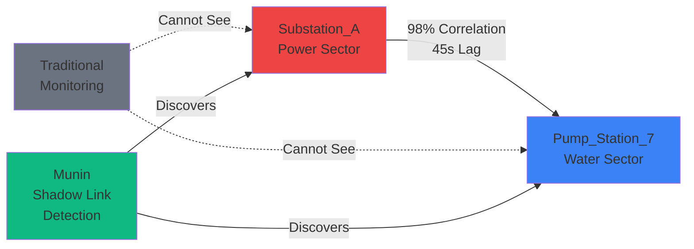
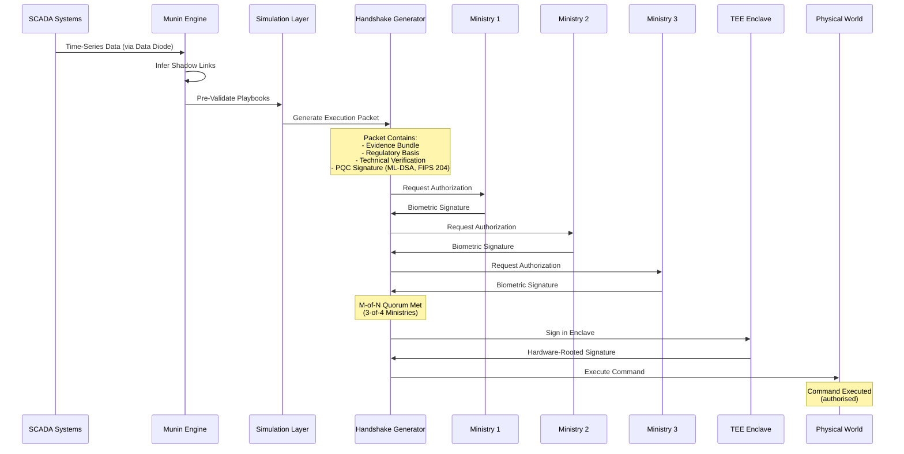
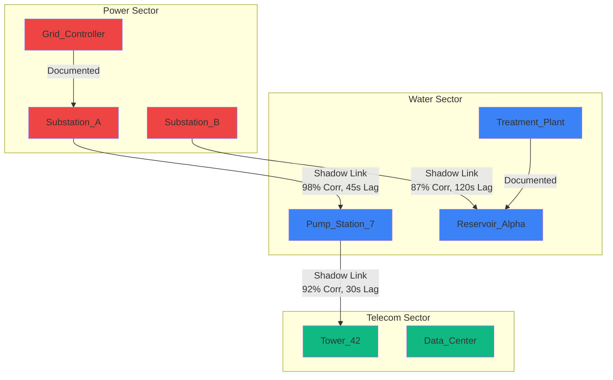

# Munin: Sovereign Infrastructure Orchestration Platform

[](https://github.com/jacobsprake/munin/actions/workflows/build.yml)
[](https://github.com/jacobsprake/munin/actions/workflows/test.yml)
[](https://github.com/jacobsprake/munin/actions/workflows/codeql.yml)

**[munin-site.vercel.app](https://munin-site.vercel.app)** | [Doctrine](docs/MUNIN_DOCTRINE.md) | [Demo Walkthrough](docs/DEMO_WALKTHROUGH.md) | [Safety Case](docs/SAFETY_CASE.md)

Munin is **decision support** for critical infrastructure operators. It reduces crisis response time by turning ad-hoc cross-agency coordination into pre-simulated, pre-packaged response options that humans can approve quickly. Munin discovers cross-sector dependencies from operational telemetry, stress-tests incident playbooks in shadow mode, and generates an **authorisation packet** containing evidence, uncertainty, safety constraints, and an audit trail. Operators and agencies still decide and sign; Munin's job is to make the decision defensible and fast.

*Humans still decide.* Munin does not execute actions autonomously; it recommends, humans authorise.

**Repository structure:** Product entry point is this README and [docs/README.md](docs/README.md) (documentation index). Core app: `app/`, `components/`, `lib/`. Inference engine: `engine/`. Playbooks: `playbooks/`. Research and compliance: `research/`. Scripts: `scripts/` (demo setup, deploy, migrations). Internal and archived docs: `docs/internal/`.

---

## Run in 5 minutes

```bash
git clone https://github.com/jacobsprake/munin.git && cd munin
npm ci
pip install pandas numpy pyyaml
./scripts/munin demo carlisle
```

This runs the full pipeline — ingest, graph inference, cascade simulation, playbook matching, packet generation — and produces a self-contained report at `engine/out/demo_carlisle/report.md`. See [docs/DEMO_WALKTHROUGH.md](docs/DEMO_WALKTHROUGH.md) for the full scripted walkthrough.

## What to look at next

| If you have... | Start here |
|---------------|-----------|
| **5 minutes** | Run the demo above, read the generated `engine/out/demo_carlisle/report.md` |
| **10 minutes** | Read [The Munin Doctrine](docs/MUNIN_DOCTRINE.md) — the thesis, the vision, and why this is inevitable |
| **15 minutes** | [Demo Walkthrough](docs/DEMO_WALKTHROUGH.md) — step-by-step CLI with `munin graph show`, `munin edge explain`, `munin packet verify` |
| **20 minutes** | [Safety Case](docs/SAFETY_CASE.md) + [Limitations](docs/LIMITATIONS.md) — what works, what doesn't, and why v1 can't hurt anyone |
| **30 minutes** | [What's Next](docs/WHATS_NEXT.md), [Evaluation Results](research/munin_v1_results.md), [Progress Log](docs/PROGRESS_LOG.md) |

## Why this matters now

Infrastructure cascades move in minutes. Human coordination takes hours. This gap kills people.

In the 2015 Carlisle floods, cross-agency coordination delays meant the cascade had already consumed entire sectors before response could be authorized. Every major infrastructure disaster follows the same pattern: the physics outpaces the bureaucracy.

Munin compresses that gap — not by removing humans, but by pre-computing the evidence, pre-formatting the decision, and presenting it in a form that allows rapid, informed, auditable human approval. Ed25519 cryptographic signatures ensure authorization records are defensible today; the architecture supports ML-DSA (FIPS 204) dual-stack for post-quantum protection over the 30-50 year operational lifetime of the infrastructure (see [PQC Roadmap](docs/PQC_ROADMAP.md)).

---

## Wedge: flood and water (v1)

The current focus is **flood and water infrastructure** (reservoirs, pumps, floodgates) in one geography. Munin provides: cascade prediction from inferred dependencies, pre-approved playbook packets, and an audit trail. Initially **read-only and advisory**—no SCADA write access in v1. Munin is the first Sovereign Orchestration Layer designed for zero-latency crisis response, bridging the gap between operational systems (SCADA) and authority (Law).

---

## The thesis

**The main bottleneck in crisis response is not data but the time required for legal authorisation and cross-agency sign-off.** Munin addresses this by pre-validating playbooks and generating execution packets that carry the necessary regulatory basis.

**The Cascade Timeline:**
- **0 seconds**: Power substation fails
- **30 seconds**: Water pumps downstream lose power
- **2 minutes**: Water pressure drops in residential districts
- **5 minutes**: Backup generators fail due to fuel supply issues
- **15 minutes**: Critical services (hospitals, emergency services) affected
- **2-6 hours**: Human operators coordinate across agencies, verify legal authorization, execute response
- **Result**: Cascade has already consumed entire sectors before response can be authorised

**Munin maintains exhaustive pre-simulation of the scenario space—single-origin failures, multi-fault and correlated (shadow-link) stress scenarios—with a continuously updated library of pre-approved playbooks and cryptographic execution packets that carry the required regulatory basis.**

### Trust: why the packet is defensible

The authorisation packet is built for **trust**: an evidence bundle (which dependencies, correlation windows, confounders), explicit uncertainty (e.g. confidence intervals, counterexample windows), safety constraints (Logic-Lock, playbook invariants), and a full audit trail. Operators and agencies see what the recommendation is based on and can reject or approve; Munin never executes.

---

## Shadow Links: Cross-sector dependency discovery

Infrastructure dependencies are not documented. A water pump failure cascades to power grid instability, but this relationship is not in any database—it exists only in the physics of the system.

**Traditional Systems:**
- Monitor only within-sector (water systems don't "see" power systems)
- Require manual dependency mapping (impractical at national scale)
- Cannot predict cross-sector cascades
- React after failures occur, not before

**Munin's Solution:**
- Automatically infers cross-sector dependencies from time-series correlation
- Discovers relationships that exist in physics but not in documentation
- Predicts cascades before they occur
- Enables proactive response at machine speed

### The Math Behind the Discovery

Munin uses temporal correlation analysis with lag detection to discover "Shadow Links"—dependencies that exist in the physics but are invisible to traditional monitoring systems.


```mermaid
graph LR
    A[Substation_A<br/>Power Sector] -->|98% Correlation<br/>45s Lag| B[Pump_Station_7<br/>Water Sector]
    C[Traditional<br/>Monitoring] -.->|Cannot See| A
    C -.->|Cannot See| B
    D[Munin<br/>Shadow Link<br/>Detection] -->|Discovers| A
    D -->|Discovers| B
    
    style A fill:#ef4444
    style B fill:#3b82f6
    style C fill:#6b7280
    style D fill:#10b981
```

**Example Output:**
```
[ANALYSIS] Ingesting Substation_A and Pump_Station_7 logs...
[MATCH] 98% Temporal Correlation found.
[WARNING] Physical Shadow Link detected. Sector 4 vulnerability confirmed.
```

This enables Munin to prevent cross-sector cascading failures by discovering dependencies that traditional systems cannot see.

### How we avoid false links (evidence and trust)

Correlation with lag is a **candidate generator**, not proof of causation. Confounders (weather, shared controllers, maintenance, load shedding) can produce spurious links. Munin treats trust as the product:

- **Robustness checks**: Stability across time windows, partial correlation, sensor health filtering (missingness, stuck-at, drift). Low-stability or unhealthy-sensor edges are dropped.
- **Evidence hierarchy**: Each edge has evidence windows with correlation, lag, and quality context. We surface **counterexample windows** (negative or weak correlation) as well as supporting windows, so operators see uncertainty.
- **Physics and constraints**: Logic-Lock and playbook constraints enforce invariants (e.g. max RPM, valve/pump state). Recommendations that violate constraints are rejected.
- **Evidence-quality dashboard**: The `munin evidence-quality` CLI and pipeline output HIGH/MEDIUM/LOW confidence and confounder notes so operators can judge reliability.

We do not claim causal identification from correlation alone; we claim *candidate dependencies plus evidence and controls* that make the authorisation packet defensible.

**Try it yourself:**
```bash
python3 engine/detect_shadow_link.py
```

---

## One-Command Demo (Show Don't Tell)

Run the full Carlisle flood demo start-to-finish so reviewers can see Munin in 5 minutes:

```bash
./demo.sh
# or
./scripts/munin demo carlisle-2011
```

Output includes: Shadow Links found, scenarios simulated, playbooks generated, **Traditional 2–6 hours vs Munin &lt; 4 minutes**, lives/damage impact, and authorization flow. Optional: `./scripts/munin viz cascade` then open `engine/out/demo_carlisle/cascade_animation.html` for side-by-side cascade animation. If you see a connection-refused message for `localhost:3000`, that’s the optional decision API; the demo still completes—start the app with `npm run dev` if you want the full flow.

**CLI reference:**
- `munin demo carlisle` – full pipeline demo
- `munin scenarios analyze [--output scenarios_analysis.md]` – scenario library with quantified outcomes
- `munin evidence-quality` – evidence quality dashboard (HIGH/MEDIUM/LOW confidence, confounder analysis)
- `munin applicability` – when Munin does / doesn’t apply (Katrina ✓, Texas 2021 ✗, Dubai 2024 ✗)
- `munin viz cascade` – generate cascade animation HTML
- `munin perf` – performance benchmarks
- `munin regulatory [UK|US|EU]` – regulatory compliance mapper

---

## Extended capabilities and future roadmap

*The main story for v1 is the wedge (flood/water, read-only) and trust (evidence, uncertainty, constraints, audit). The sections below describe the full technical stack and future roadmap (e.g. sovereign mesh, satellite verification, digital vault, safety PLCs)—not all are deployed in the initial wedge.*

### Post-Quantum Cryptography (PQC)

**Algorithm**: ML-DSA (FIPS 204), Dilithium3 parameter set

**Why**: Quantum computers will break current cryptographic signatures (RSA, ECDSA) by 2030. Munin must be future-proof.

**Decision**: All critical commands are signed with ML-DSA (FIPS 204), ensuring that even if quantum decryption becomes available, Munin's authorization packets remain cryptographically secure.

See [research/pqc-whitepaper.md](./research/pqc-whitepaper.md) for detailed technical analysis.

### Hardware Data Diodes

**What**: Physical one-way data flow devices (data cannot flow out)

**Why**: Air-gapping is the only way to guarantee that Munin cannot be remotely compromised. No outbound network traffic is possible.

**Decision**: All data ingestion happens through hardware data diodes. Munin operates in a physically isolated network.

### Trusted Execution Environments (TEE)

**Platforms**: Intel SGX, ARM TrustZone, AMD SEV

**Why**: Even if an attacker gains root access, they cannot bypass hardware-rooted validation. Logic-Lock (physics validation) runs inside TEE enclaves.

**Decision**: All handshake signing happens in TEE enclaves, providing digital sovereignty over foreign hardware.

### Byzantine Fault Tolerance (M-of-N Multi-Signature)

**Why**: A single compromised administrator or rogue official could sabotage critical infrastructure. Traditional access control (username/password) is insufficient for national-scale operations.

**Decision**: Critical actions require M-of-N cryptographic signatures from physically separated ministries. Even if 1 ministry is compromised, action cannot be authorised.

**Example**: 3-of-4 ministries must sign to authorise opening a dam during a flood. No single person or ministry can authorise alone.

### Protocol Translation Layer

**Protocols**: Modbus, DNP3, Profibus, BACnet, OPC UA, IEC 61850

**Why**: Legacy infrastructure uses protocols from the 1980s-2000s. These protocols are vendor-locked, temporally distributed, and non-interoperable.

**Decision**: All protocols are translated into a unified time-series format, enabling "zero-rip-and-replace" integration with existing infrastructure.

---

## The Authoritative Handshake Flow

**How Munin transforms inference into permission:**


```mermaid
sequenceDiagram
    participant SCADA as SCADA Systems
    participant Munin as Munin Engine
    participant Sim as Simulation Layer
    participant Handshake as Handshake Generator
    participant Ministry1 as Ministry 1
    participant Ministry2 as Ministry 2
    participant Ministry3 as Ministry 3
    participant TEE as TEE Enclave
    participant Physical as Physical World

    SCADA->>Munin: Time-Series Data (via Data Diode)
    Munin->>Munin: Infer Shadow Links
    Munin->>Sim: Pre-Validate Playbooks
    Sim->>Handshake: Generate Execution Packet
    
    Note over Handshake: Packet Contains:<br/>- Evidence Bundle<br/>- Regulatory Basis<br/>- Technical Verification<br/>- PQC Signature (ML-DSA, FIPS 204)
    
    Handshake->>Ministry1: Request Authorization
    Ministry1->>Handshake: Biometric Signature
    Handshake->>Ministry2: Request Authorization
    Ministry2->>Handshake: Biometric Signature
    Handshake->>Ministry3: Request Authorization
    Ministry3->>Handshake: Biometric Signature
    
    Note over Handshake: M-of-N Quorum Met<br/>(3-of-4 Ministries)
    
    Handshake->>TEE: Sign in Enclave
    TEE->>Handshake: Hardware-Rooted Signature
    Handshake->>Physical: Execute Command
    
    Note over Physical: Command Executed<br/>(authorised)
```

**Latency Comparison:**

**Traditional Process (Without Munin):**
```
Incident Detection: 5-15 minutes
Cross-Agency Coordination: 30-60 minutes
Legal Review: 30-90 minutes
Multi-Ministry Approval: 60-120 minutes
Command Execution: 5-10 minutes
─────────────────────────────────────
Total: 2-6 hours
```

**With Munin:**
```
Incident Detection: 5-15 minutes (same)
Playbook Retrieval: <100ms (pre-validated)
Handshake Generation: <100ms (automated)
Biometric Authorization: <15 minutes (3 ministries × 5 min)
Command Execution: 5-10 minutes (same)
─────────────────────────────────────
Total: 20-30 minutes
```

**Latency Reduction: 85-90% faster response time**

---

## The Dependency Graph

**How Munin discovers cross-sector dependencies:**


```mermaid
graph TB
    subgraph "Power Sector"
        PS1[Substation_A]
        PS2[Substation_B]
        PS3[Grid_Controller]
    end
    
    subgraph "Water Sector"
        WS1[Pump_Station_7]
        WS2[Reservoir_Alpha]
        WS3[Treatment_Plant]
    end
    
    subgraph "Telecom Sector"
        TS1[Tower_42]
        TS2[Data_Center]
    end
    
    PS1 -->|Shadow Link<br/>98% Corr, 45s Lag| WS1
    PS2 -->|Shadow Link<br/>87% Corr, 120s Lag| WS2
    WS1 -->|Shadow Link<br/>92% Corr, 30s Lag| TS1
    PS3 -->|Documented| PS1
    WS3 -->|Documented| WS2
    
    style PS1 fill:#ef4444
    style PS2 fill:#ef4444
    style PS3 fill:#ef4444
    style WS1 fill:#3b82f6
    style WS2 fill:#3b82f6
    style WS3 fill:#3b82f6
    style TS1 fill:#10b981
    style TS2 fill:#10b981
```

**Shadow Links (amber) are cross-sector dependencies that exist in physics but are not documented. Traditional monitoring systems cannot see these relationships.**

---

## Documentation

Full technical documentation is in [`docs/`](docs/). Key entry points:

| Document | What it covers |
|----------|---------------|
| [Munin Doctrine](docs/MUNIN_DOCTRINE.md) | Vision, contrarian thesis, 10-year view |
| [Safety Case](docs/SAFETY_CASE.md) | GSN claims, evidence, residual risks |
| [Threat Model](docs/THREAT_MODEL.md) | NIST 800-82 / STRIDE, attacker profiles, mitigations |
| [Limitations](docs/LIMITATIONS.md) | What doesn't work yet, open research questions |
| [What's Next](docs/WHATS_NEXT.md) | Concrete roadmap, what needs funding |
| [Operator Handbook](docs/OPERATOR_HANDBOOK.md) | Plain-language guide for infrastructure operators |
| [Ministry Integration](docs/MINISTRY_INTEGRATION.md) | How Munin deploys inside government |
| [PQC Roadmap](docs/PQC_ROADMAP.md) | Post-quantum crypto integration timeline |
| [TEE Roadmap](docs/TEE_ROADMAP.md) | Hardware enclave integration plan |
| [Evaluation Results](research/munin_v1_results.md) | Benchmark metrics on synthetic + real data |
| [Progress Log](docs/PROGRESS_LOG.md) | Chronological build history |
| [Architecture Decisions](docs/adr/) | ADRs for key design choices |

See also: [SAFETY_ANALYSIS_STPA.md](docs/SAFETY_ANALYSIS_STPA.md), [IEC62443_MAPPING.md](docs/IEC62443_MAPPING.md), [HAZARD_LOG.md](docs/HAZARD_LOG.md), [GOVERNANCE.md](docs/GOVERNANCE.md), [MISUSE_AND_ABUSE.md](docs/MISUSE_AND_ABUSE.md), [HUMAN_FACTORS.md](docs/HUMAN_FACTORS.md), [DIGITAL_TWIN.md](docs/DIGITAL_TWIN.md), [INGESTION_AT_SCALE.md](docs/INGESTION_AT_SCALE.md), [FOUNDER_NOTES.md](docs/FOUNDER_NOTES.md).

---

## License

**All Rights Reserved. Evaluation License Only.**

This software and associated documentation are proprietary and confidential. This repository is provided for evaluation and demonstration purposes only. Commercial use, production deployment, or integration into operational systems requires explicit written authorization. See the [LICENSE](./LICENSE) file.

---

*Contact: jacob@sprake.co | [munin-site.vercel.app](https://munin-site.vercel.app)*
